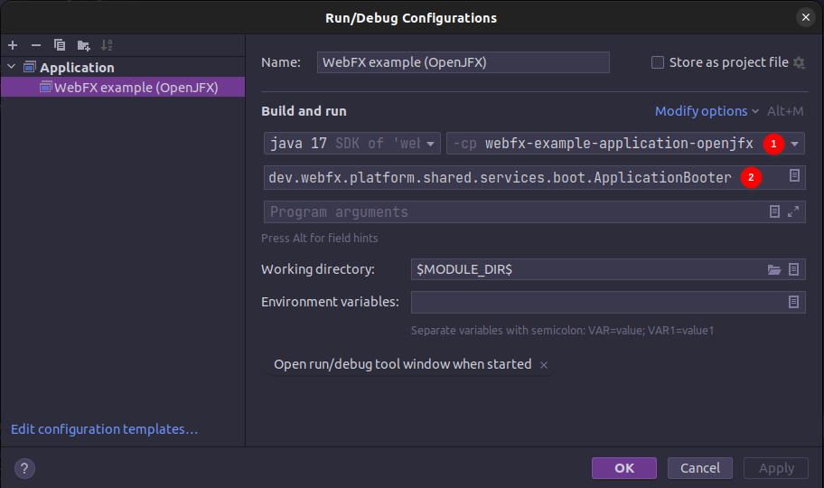

= WebFX Documentation
:icons: font
:toc: left
:toclevels: 2
:source-highlighter: pygments
Last updated: {docdate}

== Introduction

=== What is WebFX?

WebFX is a JavaFX application transpiler powered by link:https://www.gwtproject.org[GWT^]. It can transpile a JavaFX application into a traditional self-contained pure JavaScript web app (with no plugin or server required for its execution in the browser).

=== How it works

[.text-center]
[plantuml, webfx-how-it-works, format=svg]
----
skinparam ranksep 5
skinparam nodesep 5

rectangle "OpenJFX" {
    node "Higher layer" as o1
    node "Lower layer" as o2
}
o1 --[hidden]> o2

usecase "Patching\nprocess" as pp
usecase "Replaced\nby" as rb
pp --[hidden]> rb

rectangle "WebFX kit" {
    node "GWT compatible\n        version" as w1
    node "  Scene graph -> DOM\n            mapper" as w2
}
w1 --[hidden]> w2

rectangle "Your repository" {
    node "Your JavaFX app" as app
    usecase "GWT" as gwt
    node "Web app" as wa
}

o1 -r-> pp
pp -r-> w1

o2 -r-> rb
rb -r-> w2

app -[dotted]> o1: uses JavaFX API

app -d-> gwt
w1 -r-> gwt
w2 -r-> gwt
gwt -d-> wa

' Adding more hidden arrows to force vartical alignment of elements in the "Your repository" rectangle
app -[hidden]> gwt
app -[hidden]> gwt
gwt -[hidden]> wa
----

The link:https://github.com/webfx-project/webfx/tree/main/webfx-kit[WebFX kit^] is the heart of WebFX. It's a modified version of OpenJFX that can be transpiled. This is achieved by patching the higher layer of OpenJFX (which contains the main JavaFX features and API) to make it GWT compatible, and by replacing the lower layer (the graphic rendering pipeline) by a scene graph -> DOM mapper (the DOM being finally rendered by the browser).

=== Limitations

The WebFX kit coverage is for now limited to the essential features of JavaFX. So to successfully compile to the web, your JavaFX code needs to meet these 2 requirements:

* use only the features covered by the WebFX kit (you can check out the link:https://javadoc.webfx.dev[JavaDoc^] to get an idea of this coverage)
* be compatible with GWT (no reflection, no multi-threading, no blocking code, etc...)

When a JavaFX application meets these 2 requirements, we will call it a _WebFX application_, and it can be transpiled to the web simply by running a GWT compilation of it together with the WebFX kit.

NOTE: Note for the impatient: OpenJFX is a huge library (about 10MB) compared to standard JS frameworks (typically 100KB). It will take time to complete its coverage. Thanks for your understanding.

=== Benefits

==== No server

There are already great solutions to run Swing or JavaFX applications in the browser without plugins by actually running them on a server. And these solutions don't have the limitations WebFX currently has. However, a standard self-contained JS packaging is a much more simple, scalable and reliable execution model. This is precisely that benefit that WebFX is offering, and probably the main reason why you would prefer it over the other existing solutions.

==== Cross-platform

[.text-center]
[graphviz, webfx-cross-platform, format=svg]
----
digraph {
    "Your WebFX application" -> "Web\nAll major browsers" [headlabel="WebFX" labeldistance=4.5 labelangle=20];
    "Your WebFX application" -> "Desktop\nWindows, macOS & Linux" [headlabel="Java or Gluon" labeldistance=2.7 labelangle=-7];
    "Your WebFX application" -> "Mobiles\nAndroid & iOS" [label="Gluon"];
}
----

In addition to the web platform, a WebFX application can also run on desktops & mobiles. WebFX will invoke the standard Java toolchain to produce desktop executables (embedding an optimized JRE), and the Gluon toolchains to produce native executables for the desktop and mobiles.

Some alternative technologies or JVM language allow you to do the same but only for the application logic, because they don't offer a cross-platform UI toolkit. With WebFX, you can do a full cross-platform development of your entire application from a single source code base.

==== Java full-stack

Writing your whole stack in Java is a big advantage, keeping your environment simple and homogenous from a single Java IDE. Not only you don't need to master other complex ecosystems such as JavaScript or TypeScript, but you can also share the common code between your backend and frontends with the Java module system, a great advantage compared to heterogeneous systems.

==== Performance

Despite the big size of OpenJFX, WebFX can produce lightweight web apps, as demonstrated by the demos and the website:

[cols="1,^1"]
|===
|WebFX application | JS size *

|link:https://colorfulcircles.webfx.dev[Colorful circles demo^]
|90.6 kB
|link:https://particles.webfx.dev[Particles demo^]
|90.3 kB
|link:https://tallycounter.webfx.dev[Tally counter demo^]
|101 kB
|link:https://moderngauge.webfx.dev[Modern gauge demo^]
|139 kB
|link:https://medusaclock.webfx.dev[Medusa clock demo^]
|180 kB
|link:https://enzoclocks.webfx.dev[Enzo clocks demo^]
|253 kB
|link:https://fx2048.webfx.dev[FX2048 demo^]
|178 kB
|link:https://spacefx.webfx.dev[SpaceFX demo^]
|139 kB
|link:https://raytracer.webfx.dev[Ray tracer demo^]
|135 kB
|link:https://mandelbrot.webfx.dev[Mandelbrot demo^]
|142 kB
|link:https://preview.webfx.dev[Website^]
|218 kB
|===

[small]#* compressed JS size transiting over the network, without eventual images or other resources#

The secret? Here are the 3 main ingredients for this magic:

* The scene graph -> DOM mapper is much thinner than the original OpenJFX lower layer which has to reimplement many features a browser already has.
* GWT runs a dead code elimination, which removes the JavaFX classes not used by the WebFX application.
* GWT produces an amazingly compaq and optimized JS code.

The later point also confers an excellent execution speed to your web app.

==== Low learning curve

WebFX is not yet another UI toolkit to learn, but nothing else than the already well known and documented JavaFX API. All the powerful features you love like JavaFX bindings available for your web app. You will just feel at home with WebFX!

==== Fast development cycles

You don't need to run regular GWT compilations like you would do with a traditional GWT development, because you can already run and debug your WebFX application directly in your Java IDE with the OpenJFX runtime. You typically transpile your app only at the end of a development cycle to check the web version, after you have finished developing a feature using the standard JavaFX development model.

==== Free and open source

WebFX is an open source initiative under Apache 2.0 license.

== Getting started

=== Pre-requisites

To develop WebFX applications, you will need the following software already installed on your development machine:

 * JDK 13 or above
 * Maven
 * Git
 * Your preferred Java IDE

=== Introducing the WebFX CLI

The WebFX CLI is a Command Line Interface tool that will assist you developing WebFX applications. It will create your application modules as follows:

[plantuml, webfx-app-structure, format=svg]
----
skinparam Legend {
	BackgroundColor transparent
	BorderColor transparent
    FontSize 18
    FontColor #444
}
legend
Your repository
|_ xxx-application (1)
|_ xxx-application-gluon (2)
|_ xxx-application-gwt (3)
|_ xxx-application-openjfx (4)
end legend
----
<1> This module contains the JavaFX code of your application. It is cross-platform (not yet bound to a specific platform) and therefore not executable.
<2> This module targets the native desktop & mobile platforms. It binds your application with the OpenJFX runtime, and can call the Gluon toolchain to produce the Windows, macOS, Linux, Android & iOS native executables (depending on the OS of your local machine).
<3> This module targets the web platform. It binds your application with the WebFX kit, and can call GWT to produce the web app.
<4> This module targets the standard desktop platform. It binds your application with the OpenJFX runtime, and is directly executable in your IDE. It can also call the standard Java toolchain to produce the desktop executables (Windows, macOS or Linux) with an embed JRE.

You can create several WebFX applications in the same repository. If your application code grows, you can split your code into more modules. The CLI will help you to create and maintain all your modules. For each module, it will create and maintain your build chain as follows:

[.text-center]
[graphviz, wbfx-cli, format=svg]
----
digraph {
    node [ shape=rectangle ];
    "webfx-cli" [shape=ellipse];
    "webfx.xml" -> "webfx-cli"
    "Your module source code" -> "webfx-cli"
    "webfx-cli" -> "pom.xml"
    "webfx-cli" -> "module-info.java"
    "webfx-cli" -> "GWT module.gwt.xml
super sources, bundles, etc..."
    "webfx-cli" -> "GraalVM conf"
}
----

Your inputs will be centralized in the WebFX module files named webfx.xml (same location as pom.xml), and the CLI will generate the rest of the build chain from them. For example, a typical directive in webfx.xml will be:

    <dependencies>
        <used-by-source-modules/>
    </dependencies>

This directive is asking the CLI to identify the list of your dependencies from an analysis of your source code, and automatically populate the dependencies in pom.xml, module-info.java, module.gwt.xml, etc...

During that process, the CLI takes care of the cross-platform aspects: when a feature is platform-dependent (a different implementation exists for different platforms), it will pick up the right modules (those whose implementation matches the target platform). This is at this point for example that it will replace the OpenJFX modules with the WebFX kit ones in your GWT application module.

=== Installing the WebFX CLI

Since we haven't published any release at this stage yet, the way to install the CLI for now is to clone the https://github.com/webfx-project/webfx-cli[webfx-cli] repository, and build it with Maven.

NOTE: We will distribute the CLI in a better way with the first WebFX official release.

==== Cloning the webfx-cli repository

[source,shell,indent=0,role="primary"]
.SSH
----
git clone git@github.com:webfx-project/webfx-cli.git
----

[source,shell,indent=0,role="secondary"]
.HTTPS
----
git clone https://github.com/webfx-project/webfx-cli.git
----

==== Building webfx-cli with Maven

This is achieved by running the Maven _package_ goal under the webfx-cli directory:

 cd webfx-cli
 mvn package

IMPORTANT: As previously mentioned, WebFX CLI requires JDK 13 or above to successfully compile.

This generates an executable fat jar in the target folder that we can execute with java:

 java -jar target/webfx-cli-0.1.0-SNAPSHOT-fat.jar

The `webfx.sh` and `webfx.bat` script files (located under the webfx-cli directory) are simply doing this call. We will use them in the next step.

==== Creating a permanent _webfx_ alias

To easily invoke the CLI from a terminal, we need to create a permanent _webfx_ alias. This is done with the following commands (to run under the webfx-cli directory):

[source,shell,indent=0,role="primary"]
.Linux
----
echo "alias webfx='sh \"$(cd "$(dirname "$1")" && pwd -P)/$(basename "$1")/webfx.sh\"'" >> ~/.bashrc <1>

source ~/.bashrc <2>
----
<1> Adding the alias to the shell profile
<2> Applying it to the current session

[source,shell,indent=0,role="secondary"]
.macOS >= Catalina
----
echo "alias webfx='sh \"$(cd "$(dirname "$1")" && pwd -P)/$(basename "$1")/webfx.sh\"'" >> ~/.zshrc <1>

source ~/.zshrc <2>
----
<1> Adding the alias to the shell profile
<2> Applying it to the current session

[source,shell,indent=0,role="secondary"]
.macOS < Catalina
----
echo "alias webfx='sh \"$(cd "$(dirname "$1")" && pwd -P)/$(basename "$1")/webfx.sh\"'" >> ~/.bash_profile <1>

source ~/.bash_profile <2>
----
<1> Adding the alias to the shell profile
<2> Applying it to the current session

[source,shell,indent=0,role="secondary"]
.Windows (PowerShell)
----
If (!(Test-Path $profile)) { New-Item -Path $profile -Force } <1>

"`r`nfunction webfx([String[]] [Parameter(ValueFromRemainingArguments)] `$params) { . '$((Get-Item .).fullName)\webfx.bat' `$params }`r`n" >> $profile <2>

If ($(Get-ExecutionPolicy) -eq "Restricted") { Start-Process powershell -Verb runAs "Set-ExecutionPolicy -ExecutionPolicy RemoteSigned" -Wait } <3>

. $profile <4>
----
<1> Creating a PowerShell profile if it doesn't exist
<2> Adding the alias (implemented as a function) to it
<3> Lowering the execution policy if necessary to execute the profile
<4> Applying it to the current session

[source,shell,role="secondary"]
.Windows (manual)
----
You can simply add the webfx-cli repository to your environment path, so webfx.bat will be directly executed when typing the webfx command.
----

Then you should be able to invoke the CLI from the terminal:

 webfx --help

==== Updating the WebFX CLI to the latest version

You can check for update at anytime by running:

 webfx bump cli

If a new version is available, it will download it and build it for you.

NOTE: This is so far the only command that uses `git` (a `git pull` of the webfx-cli repository). The CLI will not call `git` on your own repositories.

=== Creating your first WebFX app

==== Creating and initializing your repository

Let's create our first WebFX application. We need to create the repository directory and ask the CLI to initialize it, passing it the groupId, artifactId and version of our application.

 mkdir webfx-example
 cd webfx-example
 webfx init org.example:webfx-example:1.0.0-SNAPSHOT

TIP: `webfx init org.example:1.0.0-SNAPSHOT` will also work as the CLI takes the repository directory name as the artifactId when omitted in the command.

The init command creates only 2 files: webfx.xml and pom.xml. If this is the first time you use the CLI, it will download some other files through Maven to get the essential information about the WebFX modules, before completing this job.

==== Creating your application modules

When we create an application, we pass the fully qualified name of the JavaFX class we want to create, and the prefix to use for the application modules:

 webfx create application --prefix webfx-example org.example.webfxexample.WebFxExampleApplication --helloWorld

TIP: we could omit the prefix here, because the CLI takes the parent module name in that case (which is also webfx-example here).

This command created the following modules:

[plantuml, webfx-example-structure, format=svg]
----
skinparam Legend {
	BackgroundColor transparent
	BorderColor transparent
    FontSize 18
    FontColor #444
}
legend
webfx-example
|_ webfx-example-application
|_ webfx-example-application-gluon
|_ webfx-example-application-gwt
|_ webfx-example-application-openjfx
end legend
----

The JavaFX class is located in the first module. Normally its `start()` method is empty at this stage, but because we specified the `--helloWorld` option, it has been populated with this simple template:

[source,java]
----
public class WebFxExampleApplication extends Application {

    @Override
    public void start(Stage primaryStage) {
        primaryStage.setScene(new Scene(new StackPane(new Text("Hello world!")), 800, 600));
        primaryStage.show();
    }

}
----

==== Building your application

The following command will do a simple build of your application (without generating any final executable):

 webfx build

To generate the executables for the different platforms, you need to pass some extra build options. You can discover them in the build help:

 webfx build --help

Some builds require the installation of third-party software, as shown in the following table:

[cols="1,^1,^1,^1,^1"]
|===
| Build platform |Target platform | Install command | Build option  |Executable file(s)

| Linux, macOS or Windows
| Web
|
| --gwt
| html

| Linux, macOS or Windows
| Any desktop with Java
|
| --openjfx-fatjar
| fat jar

| Linux
| Linux (embed JRE)
| ubuntu-devtools*
| --openjfx-desktop
| executable, .rpm, .deb

| macOS
| macOS (embed JRE)
|
| --openjfx-desktop
| executable, .dmg, .pkg

| Windows
| Windows (embed JRE)
| wix*, inno*
| --openjfx-desktop
| executable, .msi, .exe

| Linux
| Linux (native)
| graalvm, ubuntu-devtools
| --gluon-desktop
| executable

| macOS
| macOS (native)
| graalvm
| --gluon-desktop
| executable, .dmg, .pkg

| Windows
| Windows (native)
| graalvm, wix*
| --gluon-desktop
| executable, .msi

| Linux
| Android (native)
| graalvm, ubuntu-devtools
| --gluon-android (or --gluon-mobile)
| .apk

| macOS
| iOS (native)
| graalvm
| --gluon-ios (or --gluon-mobile)
| .ipa

|===

[small]#* these tools are optional, they are used to create installers (.rpm, .deb, .dmg, .pkg, .msi or .exe)#

We will now cover each target platform in detail.

=== Web platform

You can use the following commands to target the Web platform:

[source,shell,indent=0,role="primary"]
.Long syntax
----
webfx build --gwt <1>
webfx build --gwt --locate <2>
webfx build --gwt --reveal <3>
webfx run --gwt <4>
----
<1> Build the html executable file with the GWT Maven plugin
<2> Locate the generated executable file
<3> Reveal the generated executable file in the file explorer
<4> Execute the generated executable in the browser

[source,shell,indent=0,role="secondary"]
.Short syntax
----
webfx build -g <1>
webfx build -gl <2>
webfx build -gr <3>
webfx run -g <4>
----
<1> Build the html executable file with the GWT Maven plugin
<2> Locate the generated executable file
<3> Reveal the generated executable file in the file explorer
<4> Execute the generated executable in the browser

TIP: As opposed to `--reveal`, `--locate` works even before the build, as it prints the expected location, whether the executable file is present or not.

=== Desktop platform (JAR)

This executable requires Java installed on the target machine.

You can use the following commands to target the Desktop platform with (JAR):

[source,shell,indent=0,role="primary"]
.Long syntax
----
webfx build --openjfx-fatjar
webfx run --openjfx-fatjar
----

[source,shell,indent=0,role="secondary"]
.Short syntax
----
webfx build -f
webfx run -f
----

You can of course still use the `--reveal`, `--locate` options in addition.

TIP: You can combine the build options. For example `webfx build --gwt --openjfx-fatjar` (short syntax: `webfx build -gf`) will build both the GWT html and OpenJFX fat jar executables.

=== Desktop platform (embed JRE)

As opposed to the JAR, the embed JRE will be specific to the target platform. Therefore, a Linux machine will build a Linux executable, a Mac a macOS executable, and a Windows machine a Windows executable.

*Pre-requisite*: you can install the following software if you wish to also generate the installers:

[source,shell,indent=0,role="primary"]
.Linux
----
webfx install ubuntu-devtools <1>
----
<1> Optional. These tools are used to generate the .deb and .rpm installers.

[source,shell,indent=0,role="secondary"]
.Windows
----
webfx install wix <1>
webfx install inno <2>
----
<1> Optional. The WiX Toolset is used to create a simple .msi installer.
<2> Optional. Inno Setup is used to create a more elaborate .exe installer.

NOTE: The CLI will help you to customize these installers in a next version. For now, we just use the default settings.

Then, you can use the following commands to target the Desktop platform (embed JRE):

[source,shell,indent=0,role="primary"]
.Long syntax
----
webfx build --openjfx-desktop
webfx run --openjfx-desktop
----

[source,shell,indent=0,role="secondary"]
.Short syntax
----
webfx build -k
webfx run -k
----

=== Desktop platform (native)

Like for the embed JRE, 3 different machines are required to target the Linux, macOS, and Windows executables.

*Pre-requisites*: you must install the following software for a successful build:

[source,shell,indent=0,role="primary"]
.Linux
----
webfx install graalvm <1>
webfx install ubuntu-devtools <1>
----
<1> Required for the Gluon toolchain

[source,shell,indent=0,role="secondary"]
.macOS
----
webfx install graalvm <1>
----
<1> Required for the Gluon toolchain

[source,shell,indent=0,role="secondary"]
.Windows
----
webfx install graalvm <1>
webfx install vstools <1>
webfx install wix <2>
----
<1> Required for the Gluon toolchain
<2> Optional. WiX Toolset is used to create a simple .msi installer.

Then, you can use the following commands to target the Desktop platform (native):

[source,shell,indent=0,role="primary"]
.Long syntax
----
webfx build --gluon-desktop
webfx run --gluon-desktop
----

[source,shell,indent=0,role="secondary"]
.Short syntax
----
webfx build -t
webfx run -t
----

=== Android platform

A Linux machine is required to build the Android executable.

*Pre-requisites*: you must install the following software for a successful build:

 webfx install graalvm
 webfx install ubuntu-devtools

Then, you can use the following commands to target the Android platform (native):

[source,shell,indent=0,role="primary"]
.Long syntax
----
webfx build --gluon-android
webfx run --gluon-android <1>
----
<1> Will invoke the Gluon Maven plugin to install and run the executable on your Android device connected to your Linux machine via USB.

[source,shell,indent=0,role="secondary"]
.Short syntax
----
webfx build -a
webfx run -a <1>
----
<1> Will invoke the Gluon Maven plugin to install and run the executable on your Android device connected to your Linux machine via USB.

Alternatively, you can use the `--gluon-mobile` (short: `-b`) cross-platform option. It will be interpreted as `--gluon-android` on Linux machines.

=== iOS platform

A Mac is required to build the iOS executable.

*Pre-requisite*: you must install the following software for a successful build:

 webfx install graalvm

Then, you can use the following commands to target the iOS platform (native):

[source,shell,indent=0,role="primary"]
.Long syntax
----
webfx build --gluon-ios
webfx run --gluon-ios <1>
----
<1> Will invoke the Gluon Maven plugin to install and run the executable on your iOS device connected to your Mac via USB.

[source,shell,indent=0,role="secondary"]
.Short syntax
----
webfx build -i
webfx run -i <1>
----
<1> Will invoke the Gluon Maven plugin to install and run the executable on your iOS device connected to your Mac via USB.

Alternatively, you can use the `--gluon-mobile` (short: `-b`) cross-platform option. It will be interpreted as `--gluon-ios` on Macs.

=== GitHub workflow

We plan to add the automatic generation of GitHub workflows to the CLI. This will allow you to automatically generate the different executables on each push on the main branch.

For now, you can check out the demos to see how these GitHub workflows look like, and what executables they generate. For example, here is the link:https://github.com/webfx-demos/webfx-demo-fx2048/blob/main/.github/workflows/builds.yml[FX2048 GitHub workflow] and the link:https://github.com/webfx-demos/webfx-demo-fx2048/releases[generated executables] (just expand the release Assets to see them).

=== Developing in your IDE

We will give the instructions for IntelliJ IDEA, but you can easily transpose them to other Java IDEs.

==== Opening the project

Open the webfx-example directory from your Java IDE. It will recognize it as a Maven project, and import it.

==== Building and running the OpenJFX application

Create an application configuration as follows:

[.text-center]

<1> select the OpenJFX application module
<2> enter [red]`dev.webfx.platform.shared.services.boot.ApplicationBooter` for the main class

TIP: You can just type `AB` for the main class, and your IDE should quickly find and suggest the WebFX ApplicationBooter class.

The way to boot GWT and OpenJFX applications are different, but WebFX offers a cross-platform way to do it. For this reason, #the main class of a WebFX application is always [red monospace]+dev.webfx.platform.shared.services.boot.ApplicationBooter+#. It will find your JavaFX application because it has been automatically declared as a Java service by the CLI.

[NOTE]
====
GWT normally doesn't support the Java service API, but WebFX does, because the CLI emulates it by generating a GWT super source. You can rely on this feature to declare and implement your own services. Your services can even have platform-dependent implementations. A service can be a cross-platform UI API for example, with an OpenJFX implementation, and a different GWT implementation using a JS library you want for your web app.
====

If you run this configuration, it will build and run your WebFX application in your IDE with the OpenJFX runtime. This is this configuration that you will use to develop and debug your application.

==== Building and running the GWT application

==== Making changes

 webfx update

ifdef::backend-html5[]
== PDF version
Here is the
link:webfx-docs.pdf[PDF version,float="right"]
of this documentation.
endif::[]
