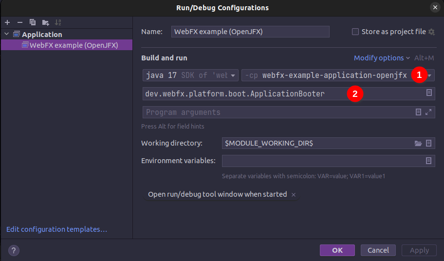

= WebFX Documentation
:icons: font
:toc: left
:toclevels: 2
:source-highlighter: pygments
Last updated: {docdate}

== Introduction

=== What is WebFX?

WebFX is a JavaFX application transpiler powered by link:https://www.gwtproject.org[GWT^]. It can transpile a JavaFX application into a traditional self-contained pure JavaScript web app (with no plugin or server required for its execution in the browser).

=== How it works

[.text-center]
[plantuml, webfx-how-it-works, format=svg]
----
skinparam ranksep 5
skinparam nodesep 5
skinparam shadowing true
skinparam rectangleShadowing false
skinparam nodeBackgroundColor f5dd90
skinparam usecaseBackgroundColor e0aaff

rectangle "OpenJFX" {
    node "Higher layer" as o1
    node "Lower layer" as o2
}
o1 --[hidden]> o2

usecase "Patching\nprocess" as pp
usecase "Replaced\nby" as rb
pp --[hidden]> rb

rectangle "WebFX kit" {
    node "GWT compatible\n        version" as w1
    node "  Scene graph -> DOM\n            mapper" as w2
}
w1 --[hidden]> w2

rectangle "Your repository" {
    node "Your JavaFX app" as app
    usecase "GWT" as gwt
    node "Web app" as wa
}

o1 -r-> pp
pp -r-> w1

o2 -r-> rb
rb -r-> w2

app -[dotted]> o1: uses JavaFX API

app -d-> gwt
w1 -r-> gwt
w2 -r-> gwt
gwt -d-> wa

' Adding more hidden arrows to force vartical alignment of elements in the "Your repository" rectangle
app -[hidden]> gwt
app -[hidden]> gwt
gwt -[hidden]> wa
----

The link:https://github.com/webfx-project/webfx/tree/main/webfx-kit[WebFX kit^] is the heart of WebFX. It's a modified version of OpenJFX that can be transpiled. This is achieved by patching the higher layer of OpenJFX (which contains the main JavaFX features and API) to make it GWT compatible, and by replacing the lower layer (the graphic rendering pipeline) by a scene graph -> DOM mapper (the DOM being finally rendered by the browser).

=== Limitations

The WebFX kit coverage is for now limited to the essential features of JavaFX. So to successfully compile to the web, your JavaFX code needs to meet these 2 requirements:

* use only the features covered by the WebFX kit (you can check out the link:https://javadoc.webfx.dev[JavaDoc^] to get an idea of this coverage)
* be compatible with GWT (no reflection, no multi-threading, no blocking code, etc...)

When a JavaFX application meets these 2 requirements, we will call it a _WebFX application_, and it can be transpiled to the web simply by running a GWT compilation of it together with the WebFX kit.

NOTE: Note for the impatient: OpenJFX is a huge library (about 10MB) compared to standard JS frameworks (typically 100KB). It may take some time to complete its coverage - thank you for your understanding. In the near future we hope to release a set of contributor guidelines and will endeavour to build an online community of developers around the project.

=== Benefits

==== No server

There are already great solutions to run Swing or JavaFX applications in the browser without plugins by actually running them on a server. And these solutions don't have the limitations WebFX currently has. However, a standard self-contained JS packaging is a much more simple, scalable and reliable execution model. This is precisely the benefit of WebFX, and probably the main reason why you would prefer it over the other existing solutions.

==== Cross-platform

[.text-center]
[graphviz, webfx-cross-platform, format=svg]
----
digraph {
    node [ shape=rectangle, fillcolor="#D0E8F2", style="filled"];
WebFX [label="Your WebFX application", fillcolor="#FDFFBC", shape=ellipse]
Web [label="Web\nAll major browsers"]
    WebFX -> Web [headlabel="WebFX" labeldistance=3.2 labelangle=30];
    WebFX -> "Desktop\nWindows, macOS & Linux" [headlabel="Java or Gluon" labeldistance=2.7 labelangle=-7];
    WebFX -> "Mobiles\nAndroid & iOS" [label="Gluon"];
}
----

In addition to the web platform, a WebFX application can also run on desktops & mobiles. WebFX will invoke the standard Java toolchain to produce desktop executables (embedding an optimized JRE), and the Gluon toolchains to produce native executables for the desktop and mobiles.

Some alternative technologies or JVM languages allow you to do the same but only for the application logic, because they don't offer a cross-platform UI toolkit. With WebFX, you can do a full cross-platform development of your entire application from a single-source codebase.

==== Java full-stack

Writing your whole stack in Java is a big advantage, keeping your environment simple and homogenous from a single Java IDE. This prevents you from having to master other complex ecosystems such as JavaScript or TypeScript, and also allows you to share common code between your backend and frontend using the Java module system - a great advantage compared to heterogeneous systems.

==== Performance

Despite the big size of OpenJFX, WebFX can produce lightweight web apps, as demonstrated by the demos and the website:

[cols="1,^1"]
|===
|WebFX application | JS size *

|link:https://colorfulcircles.webfx.dev[Colorful circles demo^]
|90.3 kB
|link:https://particles.webfx.dev[Particles demo^]
|90 kB
|link:https://tallycounter.webfx.dev[Tally counter demo^]
|101 kB
|link:https://moderngauge.webfx.dev[Modern gauge demo^]
|138 kB
|link:https://medusaclock.webfx.dev[Medusa clock demo^]
|180 kB
|link:https://enzoclocks.webfx.dev[Enzo clocks demo^]
|252 kB
|link:https://fx2048.webfx.dev[FX2048 demo^]
|178 kB
|link:https://spacefx.webfx.dev[SpaceFX demo^]
|139 kB
|link:https://raytracer.webfx.dev[Ray tracer demo^]
|134 kB
|link:https://mandelbrot.webfx.dev[Mandelbrot demo^]
|142 kB
|link:https://preview.webfx.dev[Website^]
|218 kB
|===

[small]#* compressed JS size transiting over the network, without eventual images or other resources#

The secret? Three things:

* The scene graph -> DOM mapper is much thinner than the original OpenJFX lower layer, which has to reimplement many features a browser already has.
* GWT runs a dead code elimination (tree-shaking) process, which removes the JavaFX classes not used by the WebFX application.
* GWT produces amazingly compact and optimized JS code, leading to highly-performant web apps.

==== Gradual learning curve

WebFX is not an additional UI toolkit to learn - it's an emulation of the well-known and well-documented JavaFX API. All the powerful JavaFX features that you know and love are available for your web app. You will feel right at home with WebFX!

==== Fast development cycles

You don't need to run regular GWT compilations like you would do with a traditional GWT development, because you can already run and debug your WebFX application directly in your Java IDE with the OpenJFX runtime. You typically transpile your app only at the end of a development cycle to check the web version, after you have finished developing a feature using the standard JavaFX development model.

==== Free and open source

WebFX is an open source initiative released under Apache 2.0 license.

== Getting started

=== Prerequisites

To develop WebFX applications, you will need the following software already installed on your development machine:

 * JDK 13 or above
 * Maven
 * Git
 * Your preferred Java IDE

=== Introducing the WebFX CLI

The WebFX CLI is an essential Command Line Interface tool that will assist you developing WebFX applications. It will create your application modules as follows:

[plantuml, webfx-app-structure, format=svg]
----
skinparam Legend {
	BackgroundColor transparent
	BorderColor transparent
    FontSize 18
    FontColor #444
}
legend
Your repository
|_ xxx-application (1)
|_ xxx-application-gluon (2)
|_ xxx-application-gwt (3)
|_ xxx-application-openjfx (4)
end legend
----
<1> This module contains the JavaFX code of your application. It is cross-platform (not yet bound to a specific platform) and therefore not executable.
<2> This module targets the native desktop & mobile platforms. It binds your application with the OpenJFX runtime, and can call the Gluon toolchain to produce the Windows, macOS, Linux, Android & iOS native executables (depending on the OS of your local machine).
<3> This module targets the web platform. It binds your application with the WebFX kit, and can call GWT to produce the web app.
<4> This module targets the standard desktop platform. It binds your application with the OpenJFX runtime, and is directly executable in your IDE. It can also call the standard Java toolchain to produce the desktop executables (Windows, macOS or Linux) with an embed JRE.

You can create several WebFX applications in the same repository. As your application code grows, you can split your code into more modules. The CLI will help you to create and maintain all your modules. For each module, it will create and maintain your build chain as follows:

[.text-center]
[graphviz, wbfx-cli, format=svg]
----
digraph {
    node [ shape=rectangle, fillcolor="#ffdccc", style=filled];
    WebFXCli [label="webfx-cli", shape=ellipse, fillcolor="#e0aaff"];
    WebFXXml [label="webfx.xml", fillcolor="#FDFFBC"];
    Code [label="Your module source code", fillcolor="#FDFFBC"];
    WebFXXml -> WebFXCli
    Code -> WebFXCli
    WebFXCli -> "pom.xml"
    WebFXCli -> "module-info.java"
    WebFXCli -> "GWT module.gwt.xml
super sources, bundles, etc..."
    WebFXCli -> "GraalVM conf"
}
----

Your inputs will be centralized in the WebFX module files named webfx.xml (same location as pom.xml), and the CLI will generate the rest of the build chain from them. For example, a typical directive in webfx.xml will be:

    <dependencies>
        <used-by-source-modules/>
    </dependencies>

This directive is asking the CLI to identify the list of your dependencies from an analysis of your source code, and automatically populate the dependencies in pom.xml, module-info.java, module.gwt.xml, etc...

During that process, the CLI takes care of the cross-platform aspects: when a feature is platform-dependent (a different implementation exists for different platforms), it will pick up the right modules (those whose implementation matches the target platform). It is at this point, for example, that the CLI will replace the OpenJFX modules with the WebFX kit modules in your GWT application module.

=== Installing the WebFX CLI

Since we haven't published an official WebFX release yet, the way to install the CLI for now is to clone the https://github.com/webfx-project/webfx-cli[webfx-cli] repository, and build it with Maven.

NOTE: We will distribute the CLI in a better way with the first WebFX official release.

==== Cloning the webfx-cli repository

[source,shell,indent=0,role="primary"]
.SSH
----
git clone git@github.com:webfx-project/webfx-cli.git
----

[source,shell,indent=0,role="secondary"]
.HTTPS
----
git clone https://github.com/webfx-project/webfx-cli.git
----

==== Building webfx-cli with Maven

This is achieved by running the Maven _package_ goal under the webfx-cli directory:

 cd webfx-cli
 mvn package

IMPORTANT: As previously mentioned, WebFX CLI requires JDK 13 or above to successfully compile.

This generates an executable fat jar in the target folder that we can execute with java:

 java -jar target/webfx-cli-0.1.0-SNAPSHOT-fat.jar

The `webfx.sh` and `webfx.bat` script files (located under the webfx-cli directory) are simply executing the same fat jar. We will use them in the next step.

==== Creating a permanent _webfx_ alias

To easily invoke the CLI from a terminal, we need to create a permanent _webfx_ alias. This is done with the following commands (#to run under the webfx-cli directory#):

[source,shell,indent=0,role="primary"]
.Linux
----
echo "alias webfx='sh \"$(cd "$(dirname "$1")" && pwd -P)/$(basename "$1")/webfx.sh\"'" >> ~/.bashrc <1>

source ~/.bashrc <2>
----
<1> Adding the alias to the shell profile
<2> Applying it to the current session

[source,shell,indent=0,role="secondary"]
.macOS >= Catalina
----
echo "alias webfx='sh \"$(cd "$(dirname "$1")" && pwd -P)/$(basename "$1")/webfx.sh\"'" >> ~/.zshrc <1>

source ~/.zshrc <2>
----
<1> Adding the alias to the shell profile
<2> Applying it to the current session

[source,shell,indent=0,role="secondary"]
.macOS < Catalina
----
echo "alias webfx='sh \"$(cd "$(dirname "$1")" && pwd -P)/$(basename "$1")/webfx.sh\"'" >> ~/.bash_profile <1>

source ~/.bash_profile <2>
----
<1> Adding the alias to the shell profile
<2> Applying it to the current session

////
Commented because of an issue: passing "-d" argument doesn't work
[source,shell,indent=0,role="secondary"]
.Windows (PowerShell)
----
If (!(Test-Path $profile)) { New-Item -Path $profile -Force } <1>

"`r`nfunction webfx([String[]] [Parameter(ValueFromRemainingArguments)] `$params) { . '$((Get-Item .).fullName)\webfx.bat' `$params }`r`n" >> $profile <2>

If ($(Get-ExecutionPolicy) -eq "Restricted") { Start-Process powershell -Verb runAs "Set-ExecutionPolicy -ExecutionPolicy RemoteSigned" -Wait } <3>

. $profile <4>
----
<1> Creating a PowerShell profile if it doesn't exist
<2> Adding the alias (implemented as a function) to it
<3> Lowering the execution policy if necessary to execute the profile
<4> Applying it to the current session
////

[source,shell,role="secondary"]
.Windows
----
You can simply add the webfx-cli repository to your environment path, so webfx.bat will be directly executed when typing the webfx command.
----

Now you should be able to invoke the CLI from the terminal:

 webfx --help

==== Updating the WebFX CLI to the latest version

You can check for update at anytime by running:

 webfx bump cli

If a new version is available, it will download it and build it for you.

NOTE: This is so far the only command that uses `git` (a `git pull` of the webfx-cli repository). The CLI will not call `git` on your own repositories.

=== Creating your first WebFX app

==== Creating and initializing your repository

Let's create our first WebFX application. We need to create the repository directory and ask the CLI to initialize it, passing it the groupId, artifactId and version of our application.

 mkdir webfx-example
 cd webfx-example
 webfx init org.example:webfx-example:1.0.0-SNAPSHOT

////
TIP: `webfx init org.example:1.0.0-SNAPSHOT` will also work as the CLI takes the repository directory name as the artifactId when omitted in the command.
////

The init command creates only 2 files: webfx.xml and pom.xml. Note that if this is the first time you have used the CLI, it will download some other files through Maven to retrieve essential information about the available WebFX modules.

==== Creating your application modules

When we create an application, we pass the fully qualified name of the JavaFX class we want to create, and the prefix to use for the application modules:

 webfx create application --prefix webfx-example org.example.webfxexample.WebFxExampleApplication --helloWorld

////
TIP: we could omit the prefix here, because the CLI takes the parent module name in that case.
////

This command created the following modules:

[plantuml, webfx-example-structure, format=svg]
----
skinparam Legend {
	BackgroundColor transparent
	BorderColor transparent
    FontSize 18
    FontColor #444
}
legend
webfx-example
|_ webfx-example-application
|_ webfx-example-application-gluon
|_ webfx-example-application-gwt
|_ webfx-example-application-openjfx
end legend
----

The JavaFX class is located in the first module. Normally its `start()` method is empty at this stage, but because we specified the `--helloWorld` option, it has been populated with this simple template:

[source,java]
----
public class WebFxExampleApplication extends Application {

    @Override
    public void start(Stage primaryStage) {
        primaryStage.setScene(new Scene(new StackPane(new Text("Hello world!")), 800, 600));
        primaryStage.show();
    }

}
----

==== Building your application

The following command will do a simple build of your application (without generating any final executable):

 webfx build

To generate the executables for the different platforms, you need to pass some extra build options. You can have the list in the build help:

 webfx build --help

Some builds require the installation of third-party software, as shown in the following table:

[cols="1,^1,^1,^1,^1"]
|===
| Build platform |Target platform | Install command | Build option  |Executable file(s)

| Linux, macOS or Windows
| Web
|
| --gwt
| html

| Linux, macOS or Windows
| Any desktop with Java
|
| --openjfx-fatjar
| fat jar

| Linux
| Linux (embed JRE)
| ubuntu-tools
| --openjfx-desktop
| executable, .AppImage, .rpm, .deb

| macOS
| macOS (embed JRE)
| xcode
| --openjfx-desktop
| executable, .dmg, .pkg

| Windows
| Windows (embed JRE)
| wix*, inno*
| --openjfx-desktop
| executable, .msi, .exe

| Linux
| Linux (native)
| graalvm, ubuntu-tools
| --gluon-desktop
| executable

| macOS
| macOS (native)
| graalvm, xcode-tools
| --gluon-desktop
| executable, .dmg, .pkg

| Windows
| Windows (native)
| graalvm, vs-tools, wix*
| --gluon-desktop
| executable, .msi

| Linux
| Android (native)
| graalvm, ubuntu-tools
| --gluon-android (or --gluon-mobile)
| .apk

| macOS
| iOS (native)
| graalvm, xcode-tools
| --gluon-ios (or --gluon-mobile)
| .ipa

|===

[small]#* these tools are optional, they are used to create installers (.rpm, .deb, .dmg, .pkg, .msi or .exe)#

We will now cover each target platform in detail.

=== Web platform

The link:https://github.com/tbroyer/gwt-maven-plugin[GWT Maven plugin^] will be invoked to generate the web application.

You can use the following commands:

[source,shell,indent=0,role="primary"]
.Long syntax
----
webfx build --gwt <1>
webfx build --gwt --locate <2>
webfx build --gwt --show <3>
webfx run --gwt <4>
webfx build --gwt --run <5>
----
<1> Build the html executable file with the GWT Maven plugin
<2> Locate the generated executable file
<3> Show the generated executable file in the file explorer
<4> Execute the generated executable in the browser
<5> Build the app and execute it in a single command

[source,shell,indent=0,role="secondary"]
.Short syntax
----
webfx build -g <1>
webfx build -gl <2>
webfx build -gs <3>
webfx run -g <4>
webfx build -gr <5>
----
<1> Build the html executable file with the GWT Maven plugin
<2> Locate the generated executable file
<3> Show the generated executable file in the file explorer
<4> Execute the generated executable in the browser
<5> Build the app and execute it in a single command

TIP: As opposed to `--show`, `--locate` works even before the build, as it prints the expected location, whether the executable file is present or not.

The `run` command has exactly the same options as the `build` command. The only difference between these 2 commands is that with `run` you can run the app without rebuilding it (unless `--build` is specified), and with `build` you can build the app without running it (unless `--run` is specified).

In the next sections, we won't repeat all these commands, we will use only the last command to build and run the application in one go, but of course you can still choose to separate the build and the run.

=== Desktop platform (JAR)

NOTE: The desktop JAR executable is usually used for local testing. If you want to distribute your desktop application, the embed JRE or native executables are preferred, as they don't require Java installed on the users machines.

The link:https://github.com/apache/maven-shade-plugin[Maven Shade plugin^] will be invoked to generate an executable fat jar.

You can use the following command:

[source,shell,indent=0,role="primary"]
.Long syntax
----
webfx build --openjfx-fatjar --run
----

[source,shell,indent=0,role="secondary"]
.Short syntax
----
webfx build -fr
----

TIP: You can combine the build options. For example `webfx build --gwt --openjfx-fatjar` (short syntax: `webfx build -gf`) will build both the GWT html and OpenJFX fat jar executables.

=== Desktop platform (embed JRE)

As opposed to the JAR, the embed JRE will be specific to the target platform. Therefore, a Linux machine will build a Linux executable, a Mac a macOS executable, and a Windows machine a Windows executable.

The link:https://github.com/fvarrui/JavaPackager[JavaPackager Maven plugin^] will be invoked to generate the executables and installers for the different platforms.

*Prerequisite*: you must install the following software for a successful build:

[source,shell,indent=0,role="primary"]
.Linux
----
webfx install ubuntu-tools <1>
----
<1> These tools are required by JavaPackager.

[source,shell,indent=0,role="secondary"]
.macOS
----
webfx install xcode <1>
----
<1> Just checks that Xcode is installed with the correct path, otherwise suggest solutions.

[source,shell,indent=0,role="secondary"]
.Windows
----
webfx install wix <1>
webfx install inno <2>
----
<1> Optional. The WiX Toolset is used by JavaPackager to create a simple .msi installer.
<2> Optional. Inno Setup is used by JavaPackager to create a more elaborate .exe installer.

NOTE: The CLI will help you to customize the installers (application name, icon, etc...) in a next version. For now, we just use the default settings.

IMPORTANT: On macOS, you need to configure at least a Team ID in Xcode in order to make the application runnable on your machine. We will provide a guide for this later.

Then, you can use the following command:

[source,shell,indent=0,role="primary"]
.Long syntax
----
webfx build --openjfx-desktop --run
----

[source,shell,indent=0,role="secondary"]
.Short syntax
----
webfx build -kr
----

TIP: If the application fails to run on macOS, you can try `webfx run -k --open` to execute it via the `open` command. This can open a problem report with more information.

=== Desktop platform (native)

Like for the embed JRE, 3 different machines are required to target the Linux, macOS, and Windows executables.

The link:https://github.com/gluonhq/gluonfx-maven-plugin[GluonFX Maven plugin^] will be invoked to generate the native desktops.

*Prerequisites*: you must install the following software for a successful build:

[source,shell,indent=0,role="primary"]
.Linux
----
webfx install graalvm <1>
webfx install ubuntu-tools <1>
----
<1> Required for the GluonFX Maven plugin

[source,shell,indent=0,role="secondary"]
.macOS
----
webfx install graalvm <1>
webfx install xcode <2>
----
<1> Required for the GluonFX Maven plugin
<2> Just checks that Xcode is installed with the correct path, otherwise suggest solutions.

[source,shell,indent=0,role="secondary"]
.Windows
----
webfx install graalvm <1>
webfx install vs-tools <1>
webfx install wix <2>
----
<1> Required for the GluonFX Maven plugin
<2> Optional. The WiX Toolset is called by the GluonFX Maven plugin to create a simple .msi installer.

IMPORTANT: On macOS, you need to configure at least a Team ID in Xcode in order to make the application runnable on your machine. We will provide a guide for this later.

Then, you can use the below command:

[source,shell,indent=0,role="primary"]
.Long syntax
----
webfx build --gluon-desktop --run
----

[source,shell,indent=0,role="secondary"]
.Short syntax
----
webfx build -dr
----

WARNING: On machines that don't support OpenGL (such as some Linux virtual machines), JavaFX may report: Error initializing QuantumRenderer: no suitable pipeline found. We will provide later an option to include the JavaFX software pipeline as a backup, but this will increase the size of the executable.

=== Android platform

A Linux machine is required to build the Android executable.

The link:https://github.com/gluonhq/gluonfx-maven-plugin[GluonFX Maven plugin^] will be invoked to generate the native Android application.

*Prerequisites*: you must install the following software for a successful build:

 webfx install graalvm
 webfx install ubuntu-tools

Then, you can use the following command:

[source,shell,indent=0,role="primary"]
.Long syntax
----
webfx build --gluon-android --run
----

[source,shell,indent=0,role="secondary"]
.Short syntax
----
webfx build -ar
----

Alternatively, you can use the `--gluon-mobile` (short: `-m`) cross-platform option. It will be interpreted as `--gluon-android` on Linux machines.

In this context, running the application means invoking the GluonFX Maven plugin to install and run the generated package on your Android device connected to your Linux machine via USB. For this to succeed, you must first activate the Developer mode and then the USB debugging option on your Android device.

NOTE: Only 64-bit architecture is supported (the installation will fail on 32-bit devices). Please check your Android kernel version specifies `x64`.

=== iOS platform

A Mac is required to build the iOS executable.

The link:https://github.com/gluonhq/gluonfx-maven-plugin[GluonFX Maven plugin^] will be invoked to generate the native iOS application.

*Prerequisite*: you must install the following software for a successful build:

 webfx install graalvm
 webfx install xcode

IMPORTANT: You also need a provisioning profile for your app that lists your test device, otherwise you won't be able to install the application . We will provide a guide for this later.

Then, you can use the following command:

[source,shell,indent=0,role="primary"]
.Long syntax
----
webfx build --gluon-ios --run
----

[source,shell,indent=0,role="secondary"]
.Short syntax
----
webfx build -ir
----

Alternatively, you can use the `--gluon-mobile` (short: `-m`) cross-platform option. It will be interpreted as `--gluon-ios` on Macs.

=== GitHub workflows

In a future release of the CLI we plan to support automatic generation of GitHub workflows. Each push to the main branch of your GitHub repository will then trigger the generation of all your executables on the Linux, macOS and Windows GitHub servers.

For now, you can check out the demos to see sample GitHub workflow configuration. For example, the link:https://github.com/webfx-demos/webfx-demo-fx2048/blob/main/.github/workflows/builds.yml[FX2048 GitHub workflow^] and the link:https://github.com/webfx-demos/webfx-demo-fx2048/releases[generated executables^] (expand the `Assets` link to view them).

=== Developing in your IDE

Instructions for IntelliJ IDEA are provided below, which can be quite easily transposed into other Java IDEs.

==== Opening the project

Open the webfx-example directory from your Java IDE. It should recognize the directory as a Maven project, and import it.

==== Building and running the OpenJFX application

Create an application configuration as follows:

[.text-center]

<1> select the OpenJFX application module
<2> enter [red]`dev.webfx.platform.shared.services.boot.ApplicationBooter` for the main class

TIP: You can just type `AB` for the main class, and your IDE should quickly find and suggest the WebFX ApplicationBooter class.

The way to boot GWT and OpenJFX applications is different, but WebFX offers a cross-platform way to do it. For this reason, #the main class of a WebFX application is always [red monospace]+dev.webfx.platform.shared.services.boot.ApplicationBooter+#. It will find your JavaFX application because it has been automatically declared as a Java service by the CLI.

[NOTE]
====
GWT normally doesn't support the Java service API, but WebFX does, because the CLI emulates it by generating a GWT super source. You can rely on this feature to declare and implement your own services. Your services can even have platform-dependent implementations. A service can be a cross-platform UI API for example, with an OpenJFX implementation, and a different GWT implementation using the JS library you want for your web app. We will document this later.
====

If you run this configuration, it will build and run your WebFX application in your IDE using the OpenJFX runtime. This is the configuration that you will use to develop and debug your application.

==== Building and running the GWT application

As opposed to the OpenJFX version where the IDE can use its own Java build system, the GWT version can only be built through Maven. One way to build it is to open a terminal window in your IDE, and to type `webfx build --gwt`.

[.text-center]

Another way is to trigger the build manually through the IDE Maven window.

<1> Activate the `gwt-compile` Maven profile
<2> Run the `package` Maven goal

It can be a good idea to create a configuration by selecting `Modify Run Configuration` in the context menu of that `package` goal, and press OK in the window below. You can then easily run this configuration to trigger the GWT build.

[.text-center]

Once built, you can ask your IDE to open the generated html file in a browser.

[.text-center]

<1> Locate the generated html file
<2> You can drag & drop it in the Bookmarks window for later
<3> Select the browser you want to use to open it

==== Making changes

Let's do a first little change by replacing the Text with a Button. At first sight, it looks an insignificant change, but actually it's not, because this involves a new dependency to the `javafx-controls` module (our application was only using the `javafx-graphics` module so far). To take advantage of the CLI, let's enter the fully qualified Button class name like this:

[source,java]
----
public class ExampleApplication extends Application {

    @Override
    public void start(Stage primaryStage) {
        primaryStage.setScene(new Scene(new StackPane(new javafx.scene.control.Button("Hello world!")), 800, 600));
        primaryStage.show();
    }

}
----

The IDE doesn't recognize this class yet, but let's ask the CLI to update the build chain from the terminal window:

 webfx update

The CLI should make all necessary changes in the `pom.xml`, `module-info.java`, and `module.gwt.xml` files. After a few seconds, your IDE should automatically detect and consider these changes. Then it should recognize the Button class, and allow you to import it.

Finally, let's add a simple code to react to the button:

[source,java]
----
public class ExampleApplication extends Application {

    @Override
    public void start(Stage primaryStage) {
        Button button = new Button("Hello world!");
        button.setOnAction(event -> button.setText("You clicked me!"));
        primaryStage.setScene(new Scene(new StackPane(button), 800, 600));
        primaryStage.show();
    }

}
----

You can first check the code is working as expected with the OpenJFX runtime by running the OpenJFX configuration. And then build and run the GWT version using one of the methods already explained.

Our application looks a bit sad? Maybe you can try link:https://github.com/webfx-project/webfx-example/blob/main/webfx-example-application/src/main/java/org/example/webfxexample/WebFxExampleApplication.java[this little code^] that adds a bit of colors, animation and effect?

Some more creative ideas pop up in your mind? Now is the time to play with WebFX!

ifdef::backend-html5[]
== PDF version
Here is the
link:webfx-docs.pdf[PDF version,float="right"]
of this documentation.
endif::[]
